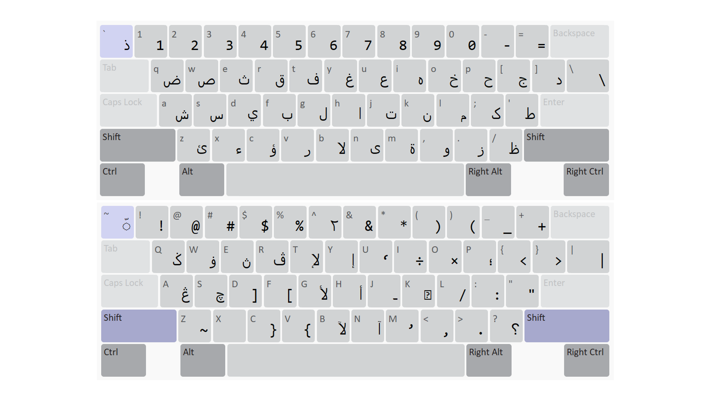

# Susun Atur Papan Kekunci Bahasa Melayu (Jawi UKM) 

Menggunakan [Keyman Engine](https://keyman.com/engine/) untuk mendapatkan susun atur susun atur papan kekunci Bahasa Melayu (Jawi UKM).

## Platform Yang Disokong 

Windows, MacOS, Linux.

## Pemasangan

**1. Pasang Keyman Engine dahulu.**

Muat turun Keyman Engine untuk sistem operasi anda pada pautan berkenaan https://keyman.com/downloads/. Kemudian pasang. Untuk linux anda perlu menggunakkan IBus sebagai input method anda. Boleh lihat wiki berkenaan https://wiki.archlinux.org/title/IBus.

**2. Muat turun fail zip pada halaman Releases.**

**3. Extract fail zip dan pasang jawi_ukm.kmp menggunakan applikasi Keyman Engine**

## Sumbangan 

https://hajiamzar.com/sumbangan/

